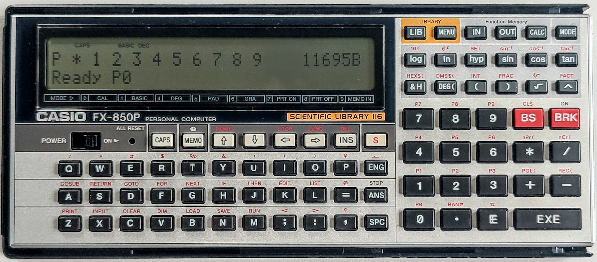

# casio-basic
A Casio Basic Project - Parser and Interpreter

This is my entry for the 
[Retrochallenge 2022/10 Competition](https://www.retrochallenge.org/p/entrants-list-202210.html) and probably 
subsequent challenges.

The Casio Pocket Computer range use a fairly standardized version 
of BASIC called [Casio PocketPC BASIC](http://foroplus.com/basic/casiopbasic.php). This project is to create a parser for 
BASIC using the programming language [Scala](https://scala-lang.org)
and the parser library [fastparse](https://github.com/com-lihaoyi/fastparse).

I have a couple of different Casio computers - I had a 
[Casio PB-410](https://ithistory.org/db/hardware/casio-computer-co-ltd/casio-pb-410) when I was a kid and loved it.
Arguably the top-of-the-range model is the [FX-850P](http://www.computinghistory.org.uk/det/20339/Casio-FX-850P/). I now own one of these 
and have built a cable that allows me to download and upload files. This will allow
 me to confirm correct behaviour of the parser/interpreter.

## 03-OCT-2022

First update! At the moment I am scouring the internet for Casio Pocket
Computer resources - I'll make a comprehensive resources list. 

My first proper task will be to document the Casio Basic dialect, with all
options for the FX-850P. The language evolved as new models were released.

I've also found some sample programs which will be really useful when testing
the parser.

----
This project is hosted on [GitHub](https://github.com/urbancamo/casio-basic).

Follow me on twitter as [@urbancamo](https://twitter.com/urbancamo).

## 04-OCT-2022

Started documenting the [Casio Basic Language](doc/casio-basic-language.md).
